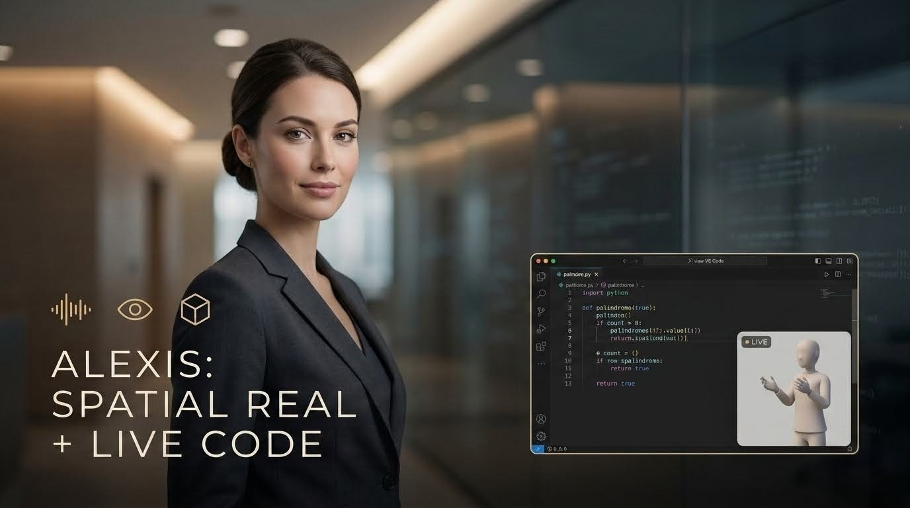
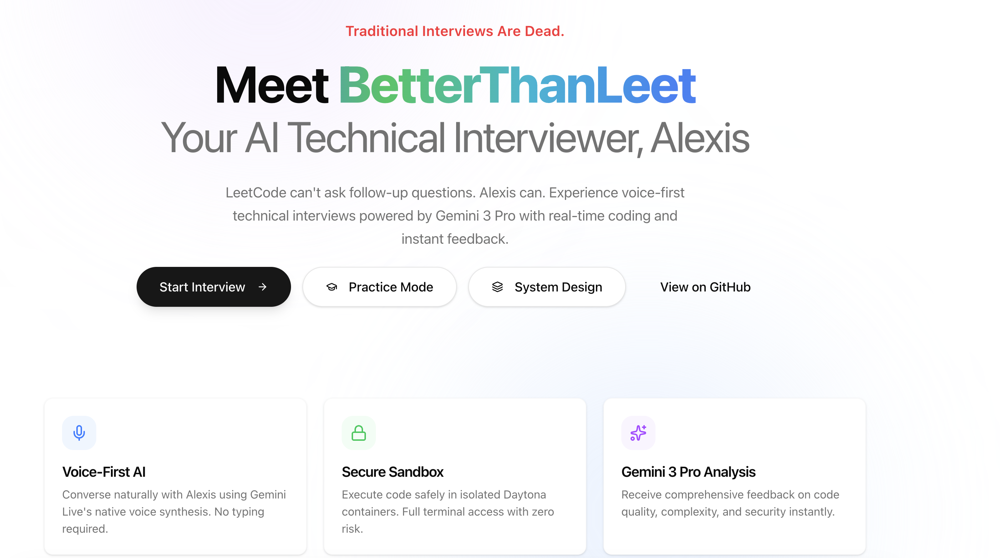
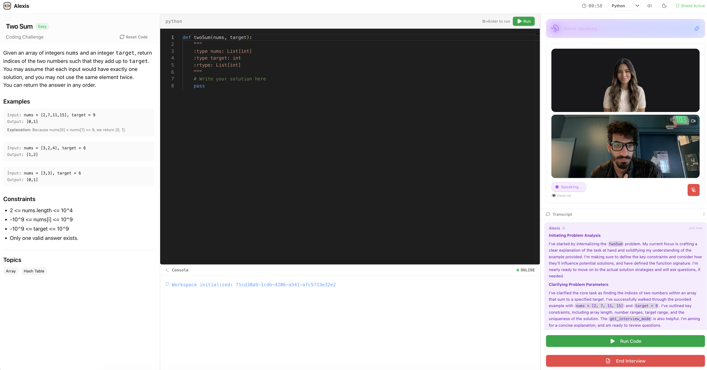
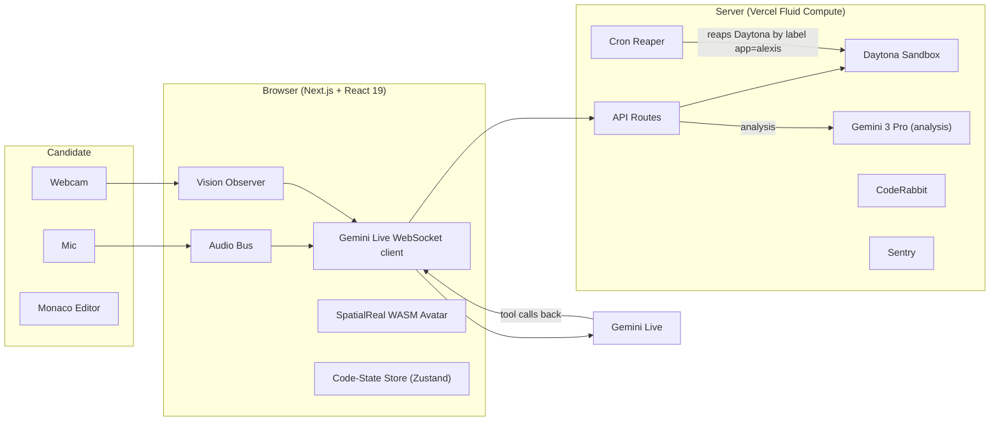

# Alexis

### The AI interviewer that sees you, hears you, and asks the question that exposes how you really think.


Hiring is a conversation. Static tests are a monologue.
Alexis is the AI that can hold the conversation — voice, vision, and live code execution in one continuous loop.
No clicks. No silence. No honor system.

## Demo

[](https://youtu.be/i8bS2GoSpwA)

<p align="center">
  <a href="https://alexis-code.vercel.app/"></a>
  <a href="https://youtu.be/i8bS2GoSpwA"></a>
  <a href="https://docs.google.com/presentation/d/1VYm6-1MB-f5Mos1foBsjGegSsH_-buWin-QHFJqqlRo/edit?usp=sharing"></a>
</p>

| Landing | Live interview |
|:---:|:---:|
|  |  |

## Why Alexis exists

- Traditional online tests are silent because machines couldn't hold a conversation; that constraint is gone; the interview that needed a face is now possible.
- Code without context is meaningless — a senior engineer needs to know *why* a candidate made a specific design choice, not just if the tests pass.
- Remote interviews lack physical presence and struggle with cheating, requiring a new approach that blends visual integrity checking with a natural, conversational flow.

## Hackathon track fit

### Native Application & Real-World Impact
Alexis solves the technical interviewing problem natively by leveraging full-duplex voice, visual presence, and spatial awareness to replace the static text box.
- Only voice surfaces "why" follow-ups.
- Only vision (webcam + Gemini Vision observations) surfaces real integrity signals.
- Only a spatial face makes the interview feel like an interview, not an interrogation.
*(See `src/components/agent/SelfView.tsx`, `src/lib/visual-observations.ts`, `src/components/agent/SpatialRealAvatar.tsx`)*

### Interaction Fluidity
The system is built for ultra-low latency, natural pacing, and spontaneous interruptions.
- Native-audio Gemini Live (no STT/TTS round trip) and VAD-driven barge-in with mid-sentence interruption.
- Server-driven SpatialReal lip-sync keyframes that stay synced at 600+ ms RTT.
- One canonical audio path (AvatarKit's internal player muted) to prevent double-voice, and one-chunk hold-back so end=true always rides on real audio.
*(See `src/lib/interview-live-client.ts`, `src/components/agent/SpatialRealAvatar.tsx`)*

### Architectural Depth
The architecture tightly couples the real-time audio/visual layer with external sandbox actions.
- Spoken intent → typed tool registry → Daytona / analysis / state, in the same event tick; voice-controlled break / end / repeat-question tools.
- Sandbox lifecycle hardened with a server-side reaper (Vercel cron, label-paginated) so tab-close doesn't orphan workspaces.
- Path sanitizer is a validate-only allow-list (`/workspace`, `/tmp`, NUL-byte blocked, traversal blocked); credential-mint endpoint behind aggressive rate-limit and `GEMINI_AUTH_MODE` flag staged for ephemeral-token migration.
*(See `src/lib/agent-tools.ts`, `src/app/api/cron/sandbox-cleanup/route.ts`, `src/lib/daytona.ts`, `src/app/api/gemini/session/route.ts`)*

## Architecture


*Voice, vision, and code state are one event stream. The agent sees, hears, and runs code in the same tick.*

## Features

### Voice (full-duplex, interruptible)
- Native-audio Gemini Live integration.
- VAD barge-in for natural interruptions.
- One-chunk hold-back for clean end-of-turn audio delivery.

### Vision (presence + integrity)
- Webcam `SelfView` for continuous candidate presence.
- Gemini Vision observations periodically sampled.
- Multi-signal integrity score (eye contact, off-screen attention, second-device detection), all streamed into the interview store.

### Spatial avatar (lipsync at network latency)
- SpatialReal AvatarKit (~970KB WASM, prefetched) rendering high-fidelity 3D presence.
- Server-driven keyframes ensuring visual sync.
- Custom audio bus subscribed to the same PCM stream that drives the speakers.

### Speech-to-Action (voice as the control plane)
- Typed tool registry bound directly to the voice agent.
- "Run it" → Daytona executeCode.
- "Fix the syntax" → autofix with diff preview.
- "I need a minute" → graceful break.
- "End the interview" → report generation.

## Quick start

### Prerequisites
- Node 18+ (LTS)
- Docker (only if running Daytona locally)
- API keys for Daytona, Gemini, SpatialReal

### Install
```bash
git clone https://github.com/yhinai/alexis.git
cd alexis
npm install
```
*(Note: Repo uses `legacy-peer-deps=true` via `.npmrc` for AvatarKit's peer conflict)*

### Configure
Create a `.env.local` file with the following keys:

| Variable | Required | Description |
|---|---|---|
| `DAYTONA_API_KEY` | Yes | Your Daytona API Key |
| `DAYTONA_API_URL` | Yes | URL for Daytona Server |
| `GEMINI_API_KEY` | Yes | Google Gemini API Key |
| `SPATIALREAL_API_KEY` | Yes | SpatialReal API Key |
| `SPATIALREAL_APP_ID` | Yes | SpatialReal App ID |
| `NEXT_PUBLIC_SPATIALREAL_AVATAR_ID` | Yes | SpatialReal Avatar ID to render |
| `SENTRY_AUTH_TOKEN` | No | Sentry token for error tracking |
| `CRON_SECRET` | No | Required if deployed to Vercel for sandbox reaper |
| `GEMINI_AUTH_MODE` | No | `direct` default; `ephemeral` when SDK ephemeral tokens land |
| `NEXT_PUBLIC_USE_MOCK_DAYTONA` | No | `true` to run UI without a real Daytona container |

### Run
```bash
npm run dev
```
Navigate to http://localhost:3000 to start an interview.

## Project structure

```text
/
├── src/
│   ├── app/
│   │   ├── api/            # API routes (Gemini auth, sandbox cleanup, execution)
│   │   └── interview/      # Main interview session pages
│   ├── components/
│   │   ├── agent/          # Agent UI (InterviewAgent.tsx, SystemDesignAgent.tsx, SpatialRealAvatar.tsx, SelfView.tsx, TranscriptPanel.tsx)
│   │   └── editor/         # Code editor components
│   └── lib/                # Core logic (interview-live-client.ts, daytona.ts, gemini.ts, visual-observations.ts, agent-tools.ts, code-history.ts, rate-limiter.ts, auth.ts, constants.ts)
├── vercel.json             # Vercel deployment configuration and cron schedules
└── plan.md                 # Project phase tracking and roadmap
```

## Engineering you can verify

- 93 tests passing, 0 failing (vitest)
- 17 API routes, ~40 lib modules, ~50 components
- Sandbox lifecycle: client cleanup is best-effort, server-side cron is the contract — see `src/app/api/cron/sandbox-cleanup/route.ts`
- Path sanitizer: validate-only allow-list, NUL-blocked, traversal-blocked — see `src/lib/daytona.ts`
- Credential-mint endpoint: rate-limited; `GEMINI_AUTH_MODE` flag staged for ephemeral tokens — see `src/app/api/gemini/session/route.ts`
- Type-safe tool registry: no `(toolFunctions as any)[name]` anywhere
- Phase plan tracked in `plan.md` (50+ items across 5 phases)

## Roadmap

### Now
- Ephemeral Gemini auth tokens.
- Candidate consent dialog.
- Demo-day fallbacks (text-only voice, static avatar).

### Next
- `BaseLiveClient` extraction to deduplicate the three live-client modules.
- Upstash Redis-backed rate limiter.
- Server-authoritative session state.

### Later
- Multi-language analyzers (TS, Go).
- Interview replay with consent.
- Keystroke + similarity-based integrity signals.

## License

This project is licensed under the MIT License.

## Acknowledgements

- **SpatialReal** for sponsoring the Voice & Vision Track.
- **Gemini Live Team** for the native-audio models.
- **Daytona** for the sandboxed code execution infrastructure.
