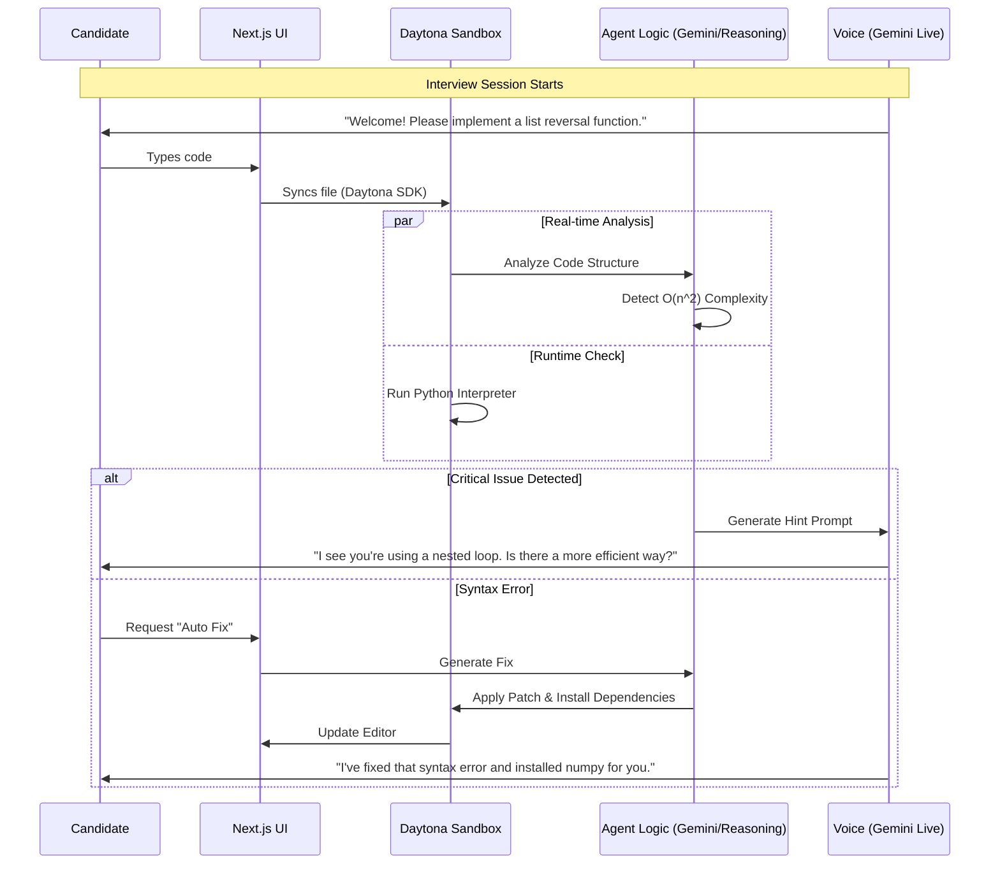
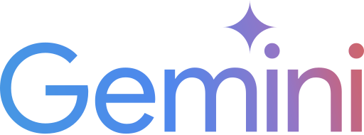
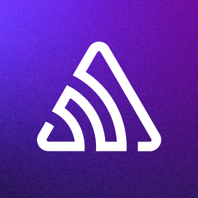

# 🎙️ BetterThanLeet

> **"LeetCode can't ask follow-up questions. Alexis can."**
>
> The AI interviewer that watches you code, spots when you're taking a suboptimal approach, and asks exactly the question a senior engineer would ask—all through voice.


## 📖 Introduction

Hiring software engineers is expensive and high-friction. Traditional coding tests are silent, isolated experiences that fail to capture a candidate's communication skills or problem-solving process.

**BetterThanLeet** changes this by creating an **interactive, voice-guided technical interview**. It combines:
- **Daytona** for a real, secure coding environment.
- **Gemini Live** for a natural, conversational AI interviewer.
- **CodeRabbit & Gemini 3 Pro** for deep, real-time code analysis.
- **Sentry** for monitoring runtime errors.

Instead of just checking if the code passes tests, this system observes *how* the candidate codes, offering hints, asking architectural questions ("Why did you choose O(n^2) here?"), and even auto-fixing syntax errors when asked.

## ✨ Key Features

- **🗣️ Conversational AI Interviewer**: Powered by Gemini Live, the agent speaks naturally, asks follow-up questions, and responds to the candidate's actions.
- **⚡ Live Daytona Sandbox**: A fully functional, ephemeral coding environment created instantly for each interview session. Supports real-time file I/O and command execution.
- **🛡️ Integrity Shield**: Built-in anti-cheat detection that tracks tab focus loss ("blur events") and suspicious paste operations.
- **📊 Comprehensive Reports**: Generates a final "Hire/No Hire" recommendation based on code quality, integrity score, and completion time.
- **🧙‍♂️ Wizard Mode (Demo)**: A fallback control system that allows a human operator to force specific voice lines via `Ctrl+Shift+X`, ensuring perfect demos even if the AI hallucinates.
- **🧠 Advanced Reasoning Engine**:
  - **Static Analysis**: Uses regex and heuristics to instantly detect complexity issues (nested loops) and security risks.
  - **AI Analysis**: Uses Gemini 3 Pro to understand code logic and generate "Senior Engineer" level feedback.
  - **CodeRabbit Integration**: Deep code reviews focusing on best practices and potential bugs.
- **🛠️ Autonomous Auto-Fix**: The agent can detect syntax/runtime errors and, upon request, autonomously patch the code and install missing dependencies (e.g., `pip install numpy`).
- **🛡️ Real-time Monitoring**: Sentry integration tracks exceptions and performance bottlenecks during the interview process.

## 📸 Screenshots

Please add screenshots to the `public/screenshots` folder.

| Interview Interface | Code Analysis |
|:---:|:---:|
|  |  |

| Voice Agent | Final Report |
|:---:|:---:|
|  |  |

## 🏗️ Architecture

The system follows a reactive event-loop architecture where the candidate's code changes trigger analysis events, which in turn drive the Voice Agent's behavior.



## 📂 Project Structure

A detailed overview of the codebase organization:

```text
/
├── public/                  # Static assets
│   └── icons/               # Official technology logos
│   └── screenshots/         # Application screenshots
├── src/
│   ├── app/                 # Next.js App Router
│   │   ├── api/             # Backend API Routes
│   │   │   ├── analysis/    # Endpoints for Gemini/CodeRabbit analysis
│   │   │   ├── sandbox/     # Daytona workspace management (create, execute)
│   │   │   └── tts/         # Direct Text-to-Speech API for Wizard Mode
│   │   ├── interview/       # Main Interview Interface Page
│   │   └── page.tsx         # Landing Page
│   ├── components/          # React Components
│   │   ├── agent/           # Voice Agent UI (Visualizer, Status)
│   │   ├── analysis/        # Review Results & Metrics Panels
│   │   ├── editor/          # Monaco Editor wrapped with Daytona sync
│   │   └── interview/       # Dashboard layout (Console, Controls, Reports)
│   └── lib/                 # Core Logic & Services
│       ├── daytona.ts       # Daytona SDK wrapper for workspace management
│       ├── gemini.ts        # Google Gemini AI integration
│       ├── coderabbit.ts    # CodeRabbit integration service
│       └── store.ts         # Zustand state management (Interview Session)
├── .env.local               # Environment variables (GitIgnored)
└── package.json             # Project dependencies
```

## 🚀 Getting Started

### Prerequisites

- **Node.js** 18+
- **Docker** (Required if running Daytona Server locally)
- **API Keys** for:
  - Daytona
  - Gemini (Google AI Studio)
  - Sentry (Optional)

### Installation

1.  **Clone the repository**:
    ```bash
    git clone https://github.com/nihalnihalani/BetterThanLeet.git
    cd BetterThanLeet
    ```

2.  **Install dependencies**:
    ```bash
    npm install
    ```

3.  **Configure Environment**:
    Create a `.env.local` file in the root directory:

    ```bash
    cp .env.example .env.local  # If example exists, otherwise create new
    ```

### Configuration

Add the following keys to your `.env.local`:

| Variable | Description | Required |
|----------|-------------|:--------:|
| `DAYTONA_API_KEY` | Your Daytona API Key | ✅ |
| `DAYTONA_API_URL` | URL for Daytona Server (default: `https://api.daytona.io`) | ✅ |
| `GEMINI_API_KEY` | Google Gemini API Key for reasoning and Gemini Live voice | ✅ |
| `SENTRY_AUTH_TOKEN` | Sentry Auth Token for monitoring | ❌ |
| `NEXT_PUBLIC_USE_MOCK_DAYTONA` | Set to `true` to simulate Daytona without Docker | ❌ |
| `NEXT_PUBLIC_USE_MOCK_CODERABBIT`| Set to `true` to mock CodeRabbit responses | ❌ |

### Running the Application

Start the development server:

```bash
npm run dev
```

Open [http://localhost:3000](http://localhost:3000) in your browser.

## 🧙‍♂️ Wizard Mode (For Demos)

**Goal**: Deliver a flawless demo presentation even if the AI is unpredictable.

1.  Enable "Wizard Mode" in the UI footer.
2.  Press **`Ctrl+Shift+X`** at any time.
3.  The system will bypass the conversational agent logic and force the voice to read the next line from the pre-defined script in `InterviewAgent.tsx`.
4.  This uses the direct `/api/tts` endpoint for low-latency playback.

## 🛠️ Technology Stack

| Component | Tech | Icon |
|-----------|------|------|
| **Frontend** | **Next.js 16** |  |
| | **React 19** |  |
| | **Tailwind CSS** |  |
| **Infrastructure** | **Daytona SDK** |  |
| | **Docker** |  |
| **AI & Voice** | **Gemini Live** |  |
| | **Gemini 3 Pro** |  |
| **Analysis** | **CodeRabbit** |  |
| **Monitoring** | **Sentry** |  |

## 🧪 Development & Testing

**Mock Mode**:
To develop the UI without spinning up real Docker containers or consuming API credits, enable Mock Mode in `.env.local`:
```env
NEXT_PUBLIC_USE_MOCK_DAYTONA=true
NEXT_PUBLIC_USE_MOCK_CODERABBIT=true
```

## 🤝 Contributing

1.  Fork the repository.
2.  Create a feature branch (`git checkout -b feature/amazing-feature`).
3.  Commit your changes (`git commit -m 'Add some amazing feature'`).
4.  Push to the branch (`git push origin feature/amazing-feature`).
5.  Open a Pull Request.

---

*Built for the Better Hack hackathon. Traditional interviews are dead.*
